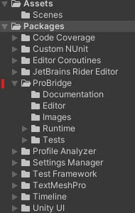

# Unity ProBridge

Unity ProBridge is part of the ProBridge System, designed for seamless communication between Unity and ROS. For ROS integration, see [RosProBridge](https://github.com/RosProBridge/RosProBridge). With the Sensors plugin ([UnityBridgeSensors](https://github.com/RosProBridge/UnityBridgeSensors)), you can simulate sensors in Unity and send data to ROS effortlessly.

## Installation Guide
### Prerequisites

Before you begin, ensure you have the following:

- Git installed on your computer.
- Unity Editor 2018.4 or later installed and ready to use.
- [NuGetForUnity](https://github.com/GlitchEnzo/NuGetForUnity) Installed, Check their README for installation and usage guide.

### 1. Installing NetMQ through NuGetForUnity

First we'll need to install NetMQ through NuGetForUnity:

- Open the NuGetForUnity menu by clicking on  `NuGet` > `Manage NuGet Packages`

- Then search for `NetMQ` in the search box and select `NetMQ` from the results

- Click on the `Install` button to install the package

- After the installation, go to the Installed tab, expand the `Implicitly installed packages` drop down
- Make sure you only have these 3 packages and **_uninstall_** anything else.

### 2. Accessing Package Manager in Unity

Next, you need to open Unity and access the Package Manager:

- Launch Unity and open your project.
- Go to `Window` > `Package Manager` to open the Package Manager window.

### 3. Adding Package from git URL

Within the Package Manager:

- Click the `+` button in the top left corner.
- Select `Add package from git URL...`.
- Add the following link `https://github.com/RosProBridge/UnityBridge.git`

### 4. Verifying Installation

If the installation process was successful, you should now be able to see `ProBridge` listed among the installed packages in the Package Manager. This confirms the package is ready for use in your project.

## Documentation

For usage details and how to create new custom publisher and subscribers check the [Documentation](/Documentation/docs.md)